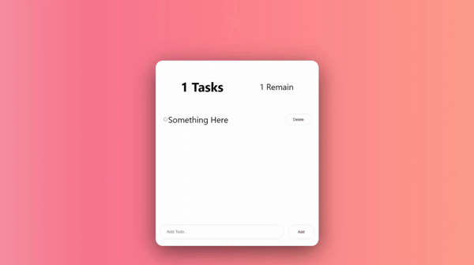

# Simple Todo List

## 새로 배운 React를 활용해서 TodoList를 제작해보자

# 사용기술 / 라이브러리
- React
- styled-components
- Hooks
    - useState
    - useEffect

# First Day 01/06

## Flex를 사용하면서 어려웠던 점
- 생각보다 초기 flex구조를 잡기가 힘들었다
- `container`에 자주 사용됐던 속성 : `justify-content`, `align-items`, `flex-direction`
- 새로 알게 된 속성의 `값` : `space-around` -> 예는 사용하면 끝에 여유를 갖고 붙이더라. 마치 `gap`을 준것마냥

## Transition속성
- 마우스를 올리면 배경색이나 테두리 색, 글자 크기를 변경하는 애니메이션? 한번만 동작하는 `Transition`을 써보았다. 
- 역시 오랜만에 써보니 어렵다. 자주 써보면서 감을 잃지 않도록 해야겠다.

## 내일 할 일
1. 내일은 `input`태그의 `checkbox`를 커스텀 해 볼것이다. 지금 default 디자인은 너무 작다. 
2. 자바스크립트 코드를 작성해서 정말로 추가, 삭제, 알림 기능을 추가해보도록 하자.
