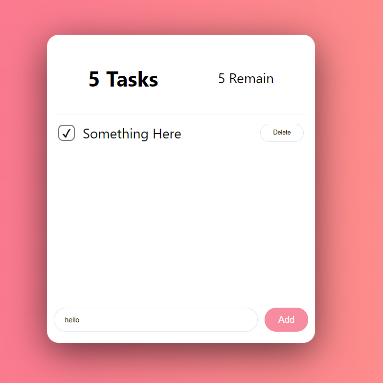
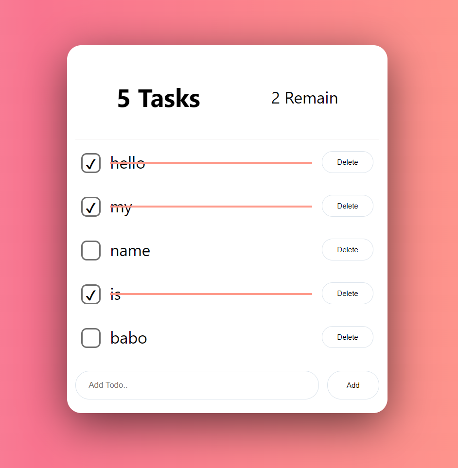

# Simple Todo List

## 새로 배운 React를 활용해서 TodoList를 제작해보자

# 사용기술 / 라이브러리
- React
- styled-components
- Hooks
    - useState
    - useEffect

# First Day 01/06

## Flex를 사용하면서 어려웠던 점
- 생각보다 초기 flex구조를 잡기가 힘들었다
- `container`에 자주 사용됐던 속성 : `justify-content`, `align-items`, `flex-direction`
- 새로 알게 된 속성의 `값` : `space-around` -> 예는 사용하면 끝에 여유를 갖고 붙이더라. 마치 `gap`을 준것마냥

## Transition속성
- 마우스를 올리면 배경색이나 테두리 색, 글자 크기를 변경하는 애니메이션? 한번만 동작하는 `Transition`을 써보았다. 
- 역시 오랜만에 써보니 어렵다. 자주 써보면서 감을 잃지 않도록 해야겠다.

## 내일 할 일
1. 내일은 `input`태그의 `checkbox`를 커스텀 해 볼것이다. 지금 default 디자인은 너무 작다. 
2. 자바스크립트 코드를 작성해서 정말로 추가, 삭제, 알림 기능을 추가해보도록 하자.

# 01/09

## 배운 점
- 리액트의 여러 훅들에 대해 공부했다. 
- 컴포넌트가 mount, state가 변경, unmount시에 이벤트를 처리하는 `useEffect`
- 마지막 변경값만을 사용해서 처리하는 `useRef`
- state의 변경을 감지하여 일종의 미리 계산하는 `useMemo` 등등 여러 `Hooks`에 대해 공부해봤고 이 메서드들을 사용해서 조금 추가해봤다.

## Checkbox 커스텀
- checkbox자체를 `display: none`처리를 해 지워버리고, `label`태그를 네모낳게 만들어서 체크박스를 만들었다. 그 후 `checked`속성을 감지하면 `::after`선택자를 사용해서 체크표시하는걸 보여줬다.

## 다음에 할 일
1. 현재 `useState`로 todos배열을 만들어놨고, Add todo...로 입력받은 todo를 하나씩 저장해놨다. 다음엔 `Something here` 부분에 추가할때마다 하나씩 리스트가 추가되는걸 직접 보여주도록 하자.
2. `Delete`버튼을 클릭하면 todo의 `clear` 값을 `true`로 바꿔주고 이에따른 `text-decoration`을 `Transition`속성과 함께 넣어보도록 하자.
2-1. <del>`Remain`값들도 하나씩 줄여주도록 하자</del> 이건 `useMemo`에서 이미 처리됐겠다.

# 01/11

## 한 일
- 추가/삭제 기능을 추가했습니다.
- 체크박스의 위치를 조정했습니다. `align-self`를 통해 특정 요소의 반대측을 center로 맞춰주었습니다.

## 배운 점
- 리액트에서 `label`태그의 for는 `htmlFor`로 작성해야한다는 사실
- ul태그 내의 li태그들을 만들 때에 리액트가 식별할 수 있는 유니크한 `key`를 만들어 줘야하는데 생각보다 쉽지 않아서 이번 프로젝트에는 `index`로 키를 줬다. `index`로 키를 줄 경우 중간에 삽입, 삭제 시 연산이 느려진다는 단점이 있다고 한다.
- 완료 체크 시 가로선이 그어지는건 가상선택자`::after`를 사용해서 새로운 `width`를 주어서 완성했다. 
- `app_form`컴포넌트 자체를 `form`태그로 감싸서 input을 입력하고 엔터로 바로 할 일을 추가할 수 있게 고쳤다.
- `Delete`버튼을 클릭하면 해당 todo가 삭제되도록 삭제 기능을 추가했다.
    - JS Array의 메서드인 `.splice`를 다시 한번 사용했다
    - `.splice`는 현재 배열을 고치는 메서드다. index를 입력받고, 지울 개수를 입력받고, 새로 추가할 요소를 인자로 받는다.

## 다음에 할 일
1. Todo-List에 할일이 너무 많으면 더이상 추가할 수 없도록 제한을 주도록 하자.
2. index로 값을 줘서 중간에 todo를 삭제하면 체크가 되어버리는 버그가 있다. 고쳐보도롥 하자!
